# Spotify: Telling Stories of Music Genre Through Data

## Introduction

Spotify is one of the largest audio and media streaming service
providers. Thus, the data collection for this company is vast. This
allows for rich data sets that helps Spotify learn about their
customers. This project takes a Spotify data set from the SpotifyR
package. SpotifyR is an R wrapper which pulls track audio features and
other information from Spotify’s Web API. We attempt to tell a story
through both supervised and unsupervised methodologies. In doing so, the
goal is to \[expand on this, won’t be clear until you go through stuff\]

## Data

The data features are plentiful but ambiguous at first glance. Let’s go
through each feature and describe what’s happening under the hood.
Spotify has curated these unique features to help them assess
information about the songs they recommend to listeners.

### Features of the Data set (Categorical)

These features are relatively less ambiguous than the qualitative ones.
Either way, we describe them in the following sub-section.

**Track\_id** is the unique song ID.

**Track\_name** is the title of the track.

**Track\_artist** is the artist of the track.

**Track\_album\_id** is the unique id of the album the track is located
in.

**Track\_album\_name** is the name of the album the track is located in.

**Track\_album\_release\_date** is the release date of the album the
track is located in.

**Playlist\_name** is the name of the playlist the track is located in.

**PLaylist\_id** is the unique id of the playlist.

**Playlist\_Genre** is the genre of the playlist.

**Playlist\_subgenre** is the sub-genre of the playlist.

### Features of the Data set (Quantitative)

**Track\_Popularity** is a track’s popularity ranging from 0 to 100. The
higher the score, the higher the track’s popularity. According to
Spotify, popularity is calculated by an algorithm and is based, in the
most part, on the total number of plays the track has had and how recent
those plays are. Generally speaking, songs that are being played a lot
now will have a higher popularity than songs that were played a lot in
the past.

**Danceability** describes how suitable a track is for dancing based on
a combination of musical elements including tempo, rhythm stability,
beat strength, and overall regularity. A value of 0.0 is least
‘danceable’ and 1.0 is most danceable.

**Energy** represents a perceptual measure of intensity and activity.
Typically, energetic tracks feel fast, loud, and noisy. For example,
Slayer, a death metal band, surely has high energy. Meanwhile a track
composed by Mozart may score low on the scale. Features contributing to
this attribute include general entropy, perceived loudness, dynamic
range, timbre, and onset rate.

**Key** ranges from integers 0 to 11 and map to pitches that represent
the key a track is in. This is because when analyzing post-tonal music,
and assuming octave and enharmonic equivalence is appropriate (this is a
fancy way of saying we classify what sounds sound the same), integers
can represent pitch class. For example, all C’s and any notes that are
enharmonically-equivalent to C (like B-Sharp) are pitch class 0. All
C-sharps’s and any notes that are enharmonically-equivalent to C-sharp
(like D-flat) are pitch class 1. The full table of pitch classes mapped
to integers are below.

<table class="table" style="margin-left: auto; margin-right: auto;">
<caption>
Key Mappings
</caption>
<thead>
<tr>
<th style="text-align:right;">
Integer
</th>
<th style="text-align:left;">
Pitch
</th>
</tr>
</thead>
<tbody>
<tr>
<td style="text-align:right;">
0
</td>
<td style="text-align:left;">
C
</td>
</tr>
<tr>
<td style="text-align:right;">
1
</td>
<td style="text-align:left;">
C-Sharp
</td>
</tr>
<tr>
<td style="text-align:right;">
2
</td>
<td style="text-align:left;">
D
</td>
</tr>
<tr>
<td style="text-align:right;">
3
</td>
<td style="text-align:left;">
D-Sharp
</td>
</tr>
<tr>
<td style="text-align:right;">
4
</td>
<td style="text-align:left;">
E
</td>
</tr>
<tr>
<td style="text-align:right;">
5
</td>
<td style="text-align:left;">
F
</td>
</tr>
<tr>
<td style="text-align:right;">
6
</td>
<td style="text-align:left;">
F-Sharp
</td>
</tr>
<tr>
<td style="text-align:right;">
7
</td>
<td style="text-align:left;">
G
</td>
</tr>
<tr>
<td style="text-align:right;">
8
</td>
<td style="text-align:left;">
G-Sharp
</td>
</tr>
<tr>
<td style="text-align:right;">
9
</td>
<td style="text-align:left;">
A
</td>
</tr>
<tr>
<td style="text-align:right;">
10
</td>
<td style="text-align:left;">
B-Flat
</td>
</tr>
<tr>
<td style="text-align:right;">
11
</td>
<td style="text-align:left;">
B
</td>
</tr>
</tbody>
</table>

**Loudness** is the quality of a sound. It is the analog of a physical
stength or amplitude of a track. It is measured in decibels (dB) and
averaged across the entire track. Loudness is useful for comparing
relative loudness among songs in the data set. It ranges roughly from
-60 to 0.5 dB.

**Mode** indicates the modality of a track and thus the type of scale
from which the tracks melodic content is derived from. It is a binary
variable that assigns a 0 to tracks that have a minor scale and a 1 to
tracks that have a major scale.

**Speechiness** detects the presence of spoken words in a track. If a
track appears more speech-like in its recording (like a podcast might),
then the speechiness score will be greater. This is a proportion, and
thus the features values range from 0 to 1. For this feature, values
that are less than 0.33 are considered music and perhaps even
instrumental music. Values between 0.33 and 0.66 are generally
considered music tracks that include both music and speech. Podcast such
as tracks have a proportion of 0.66 or greater. Since this data set only
has music, we will see the former range throughout the data set.
Furthermore, features such as speechiness are exactly why scaling the
data is necessary. Allowing for raw ranges of values would create a bias
in the data results.

**Acousticness** represents a confidence measure from 0 to 1 on whether
the track is acoustic. 1.0 represents a high confidence and 0 represents
a low confidence.

**Instrumentalness** represents a prediction of whether the track
contains vocals and the scale is from 0 to 1. The greater the score, the
greater the likelihood the track is to instrumental. Tracks that have
more vocals (such as rap) score lower on this scale. Tracks that score
0.5 or higher are *intended* to represent instrumental tracks. Thus,
scaling the data provides useful for how tracks compare in this data
set.

**Liveness** detects the presence of an audience in the recorded track.
This could be, for example, Pink Floyd’s live performance of their Dark
Side of the Moon album. There is clearly a difference between this
recording and the album when it was recorded in a studio setting.
Typically, if a track scored higher than 0.8 it is likely it was
recorded with an audience. Again, scaling will provide useful for this
feature.

**Valence** measures the musical *positiveness* of a track and is scored
from 0 to 1. Tracks with valence closer to 1 sound more positive (i.e. -
cheerful, euphoric) and tracks with low valence appear more negative
(i.e. - sad, angry).

**Tempo** is an overall estimate of a track’s beats per minute (BPM).
This is the speed of a track that is calculated by taking the average
beat duration.

**Duration\_ms** is simply the duration of the track in milliseconds.

There are two issues that arise with the data. The first issue was
already alluded to which is the measurements of this data is over all
the tracks that Spotify offers to listeners. Thus, this data will be
sampled and scaled before performing any statistical modeling. The
second issue is that many of these features seem a bit repetitive in
measuring similar attributes of tracks. For example, what is the
difference between **Acousticness**, **Speechiness**, and
**Instrumentalness**? The answer is that the latter two features
represent a prediction and probability *score* while the former feature
actually *detects* what is within a track. Regardless, this will serve
as great reason to perform a PCA analysis to understand groups of data.
Performing clustering methods will provide meaningful, interpretable
information. However, the caveat is that clustering methods partition
data (in this case, the tracks) into mutually exclusive groupings. Given
the data, this method has shortcomings that must be taken into
consideration. However, we still cluster to survey various methods.

## Data Exploration

The following section allows for exploration of the data to provide some
information about relationships among features in the data set. Before
diving into methodologies, visualizing relationships provides general
but important information to further develop the Spotify genre story
while partially motivating what methodologies to choose from.

<table class="table" style="width: auto !important; margin-left: auto; margin-right: auto;">
<thead>
<tr>
<th style="text-align:left;">
Genre
</th>
<th style="text-align:right;">
Count
</th>
</tr>
</thead>
<tbody>
<tr>
<td style="text-align:left;">
edm
</td>
<td style="text-align:right;">
1861
</td>
</tr>
<tr>
<td style="text-align:left;">
latin
</td>
<td style="text-align:right;">
1560
</td>
</tr>
<tr>
<td style="text-align:left;">
pop
</td>
<td style="text-align:right;">
1679
</td>
</tr>
<tr>
<td style="text-align:left;">
r&b
</td>
<td style="text-align:right;">
1627
</td>
</tr>
<tr>
<td style="text-align:left;">
rap
</td>
<td style="text-align:right;">
1763
</td>
</tr>
<tr>
<td style="text-align:left;">
rock
</td>
<td style="text-align:right;">
1509
</td>
</tr>
</tbody>
</table>

### Popular Artists

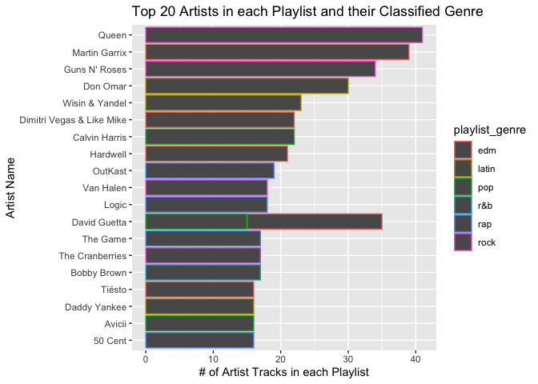

Above we observe the top artists that appear across all playlists
regardless of genre. We see that all artists are classified in one type
f genre except for David Guetta who appears 35 times in both pop and EDM
playlists This puts David Guetta in third place for this data set. Rock
is the most popular genre thanks to Queen and Guns N’ Roses.

### Song Popularity

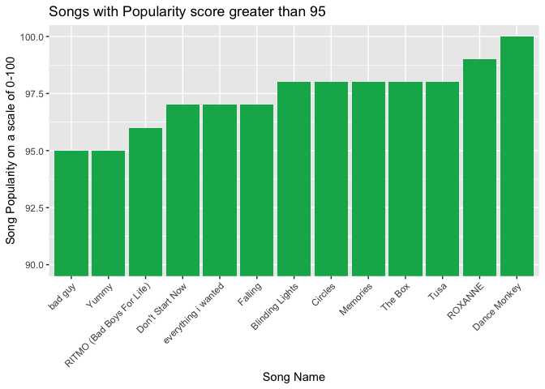

When filtering for most popular songs in the data set, we observe
Roxanne (Arizona Zerva) rated second highest following Dance Monkey
(Tones and I), and a 5-way tie with Blinding Lights (The Weekend),
Cirlces (Post Malone), Memories (Maroon 5), The Box (Roddy Rich), and
Tusa (Carol G).

### Genre Popularity

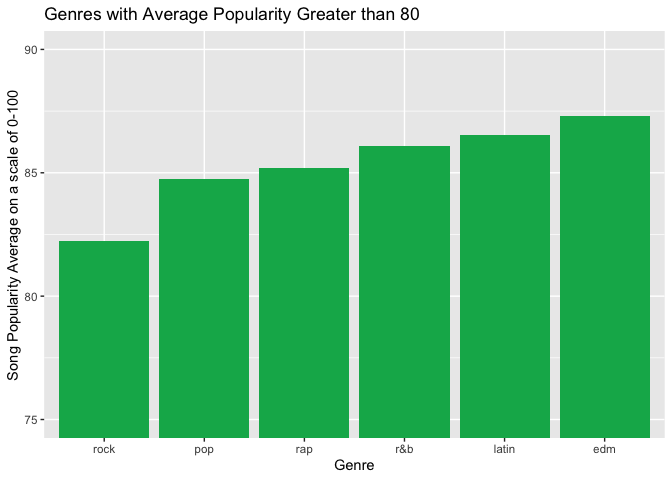

Taking the average of song popularity in each playlist genre, we see
that EDM has the highest average. With David Guetta and Martin Garrix
being two of the artists that appear in the most amount of playlists,
this makes sense.

### Popular Subgenres

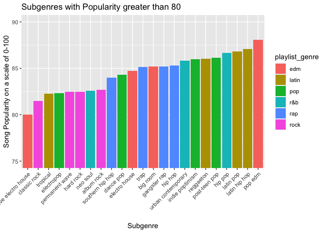

The most popular subgenres come from a mix of all 6 major genres. As we
have observed, EDM is most popular. However, it does not appear in the
most amount of popular subgenres in this data set.

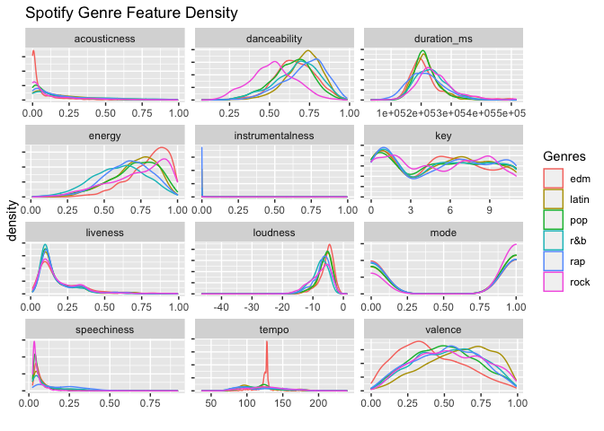

Creating kernel density estimates show the probability distribution
functions of each feature, and is essentially a smoothed over histogram.
For each feature, there represents a distribution faceted by the genre.
At the aggregate level, songs from the data set seem to have low
confidence in acousticness, low probability they are instrumental, not
likely to have been recorded with a live audience, and low speechiness.
However, danceability, valence, loudness, and energy have higher levels
of probability associated with them. For separating genres, we will
attempt to utilize the three aforementioned features.

## Modeling

Next we incorporate several methodologies to attempt to classify the
songs in the data set. We attempt tree models and then attempt to better
explain it using PCA. Then, we compare all of them to see what story is
told about the genre data set.

### Unsupervised Learning

We decided to implement k-means++ and ward agglomerative clustering to
see if track attributes, such as, danceability, energy, loudness, etc.
could be useful in predicting track genres. We chose k-means++ as a
baseline to compare any succeeding clustering methods against. Moreover,
we implemented agglomerative hierarchical clustering hoping that it
would capture the hierarchy present in genres and subgenres, if any. The
details of the two methods are discussed below.

#### K-means++ clustering

###### Choose k

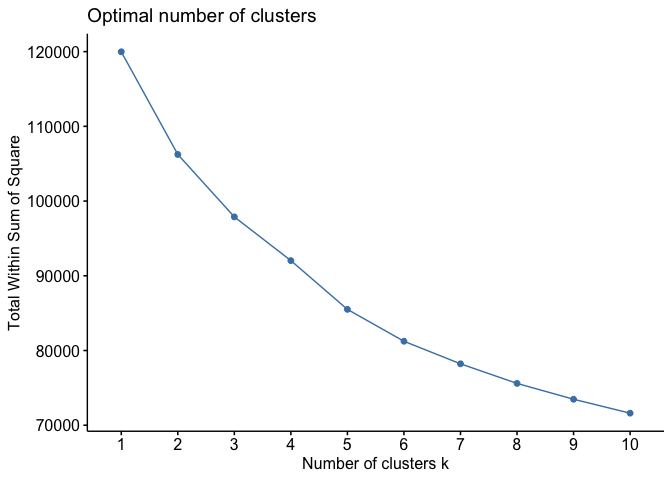

In order to choose k, we utilized the “Elbow Plot” of Total Within Sum
of Squares against values of k from 2 to 10. It can be seen that the
“elbow” shape is observed around k=5 and decreases consistently beyond
that point. Therefore, we decided to test values of k from 5 through 8
and choose the value with the highest Adjusted Rand Index. The Adjusted
Rand Index evaluates whether dimension-reduced similarity cluster
results are similar to one other. The Rand Index ranges from 0 to 1,
where it equals to 0 when points are assigned into clusters randomly and
it equals to 1 when the two cluster results are same.

###### Adjusted Rand Index (ARI) for optimal k

    ## [1] "Adjusted Rand Index for genre"

    ## Rand Index for k=5: 0.04743443

    ## Rand Index for k=6: 0.05955772

    ## Rand Index for k=7: 0.0543011

    ## Rand Index for k=8: 0.05489758

The highest Adjusted Rand Index is observed for k=6. However, the ARI
itself is not high enough to represent good clustering, specifically it
is approximately 0.06, which means that we had poor recovery for the
original genre clusters. Nevertheless, we will use k=6 to display the
results for k-means++.

#### K-means++ Cluster Summary

    ##                  clust6$center[1, ] * sigma + mu
    ## danceability                                0.51
    ## energy                                      0.81
    ## key                                         4.90
    ## loudness                                   -5.24
    ## mode                                        0.63
    ## speechiness                                 0.08
    ## acousticness                                0.06
    ## instrumentalness                            0.02
    ## liveness                                    0.26
    ## valence                                     0.37
    ## tempo                                     135.41
    ## duration_ms                            229404.65

    ##                  clust6$center[2, ] * sigma + mu
    ## danceability                                0.72
    ## energy                                      0.73
    ## key                                         6.47
    ## loudness                                   -6.08
    ## mode                                        0.00
    ## speechiness                                 0.08
    ## acousticness                                0.14
    ## instrumentalness                            0.02
    ## liveness                                    0.17
    ## valence                                     0.60
    ## tempo                                     116.59
    ## duration_ms                            220744.56

    ##                  clust6$center[3, ] * sigma + mu
    ## danceability                                0.60
    ## energy                                      0.42
    ## key                                         4.98
    ## loudness                                  -10.69
    ## mode                                        0.62
    ## speechiness                                 0.07
    ## acousticness                                0.53
    ## instrumentalness                            0.08
    ## liveness                                    0.16
    ## valence                                     0.40
    ## tempo                                     112.41
    ## duration_ms                            226670.97

    ##                  clust6$center[4, ] * sigma + mu
    ## danceability                                0.72
    ## energy                                      0.73
    ## key                                         4.73
    ## loudness                                   -6.11
    ## mode                                        1.00
    ## speechiness                                 0.08
    ## acousticness                                0.13
    ## instrumentalness                            0.01
    ## liveness                                    0.16
    ## valence                                     0.63
    ## tempo                                     115.41
    ## duration_ms                            220855.06

    ##                  clust6$center[5, ] * sigma + mu
    ## danceability                                0.66
    ## energy                                      0.78
    ## key                                         5.29
    ## loudness                                   -7.09
    ## mode                                        0.58
    ## speechiness                                 0.07
    ## acousticness                                0.07
    ## instrumentalness                            0.75
    ## liveness                                    0.19
    ## valence                                     0.40
    ## tempo                                     125.52
    ## duration_ms                            249007.11

    ##                  clust6$center[6, ] * sigma + mu
    ## danceability                                0.71
    ## energy                                      0.66
    ## key                                         5.59
    ## loudness                                   -7.07
    ## mode                                        0.50
    ## speechiness                                 0.33
    ## acousticness                                0.20
    ## instrumentalness                            0.01
    ## liveness                                    0.20
    ## valence                                     0.55
    ## tempo                                     126.56
    ## duration_ms                            218414.58

Above we can see the average scores assigned to each attribute in each
of the 6 clusters created by the k-means++ technique. The first cluster
appears to have very a low loudness score and a very high key score with
moderate energy and instrumentalness. The second cluster appears to be
relatively the same except with lower loudness, and instrumentalness,
and higher acousticness. Observing the following clusters, it is evident
that all of them have negative loudness scores with high magnitudes, as
well as, high key scores. It is unfortunate that all the clusters share
such similar properties. This explains the low Adjusted Rand Index.

###### Total Within and Between Sum of Squares

The Total Within Sum of Squares and Between Sum of Squares is displayed
below. It is clear that the Total Within Sum of Squares is much higher
than the Between Sum of Squares, which is not ideal as typically more
compact clusters have lower Total Within Sum of Squares and higher
Between Sum of Squares.

    ## Total Within Sum of Squares: 81237.27

    ## Total Between Sum of Squares: 38738.73

#### Clustering Visualization

Several clustering comparison plots are displayed below of various
attributes plotted against each other. The coloring of the data points
is defined by genres. The plots on the left reflect actual clustering
observed in the data, whereas the plots on the right reflect k-means++
clustering. It can be seen that there are not distinct genre clusters in
the original data to begin with. Perhaps that is why kmeans++ performed
so poorly in recovering these clusters. Overall, neither of the plots
reflects comparable clustering.

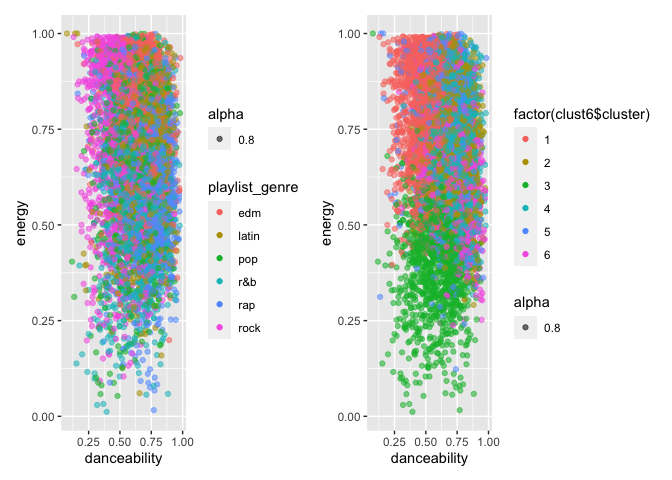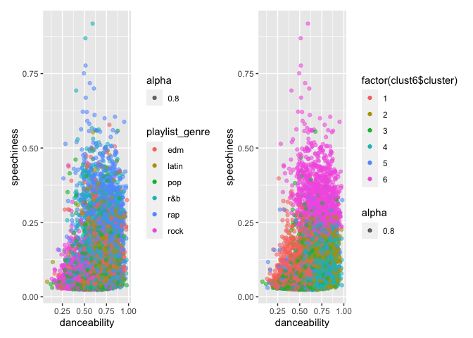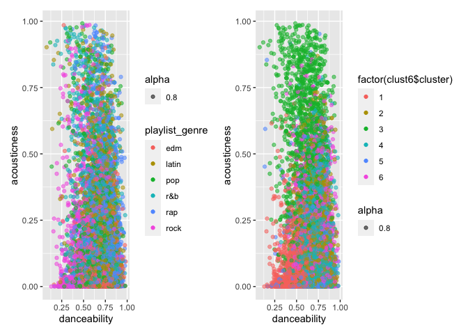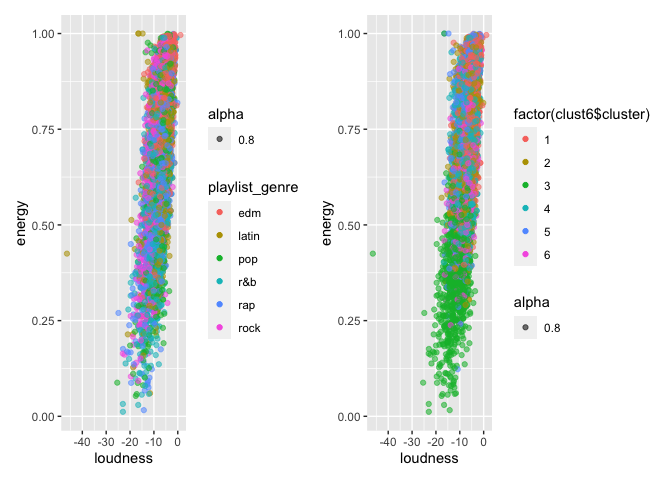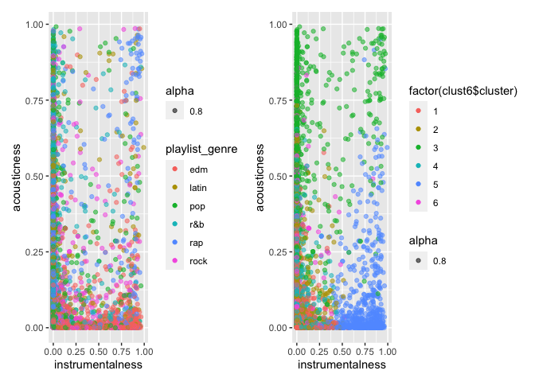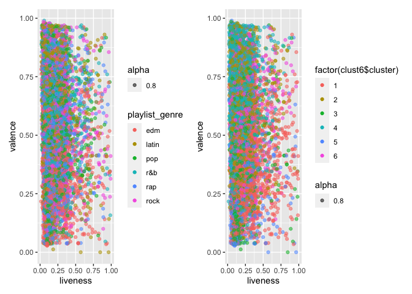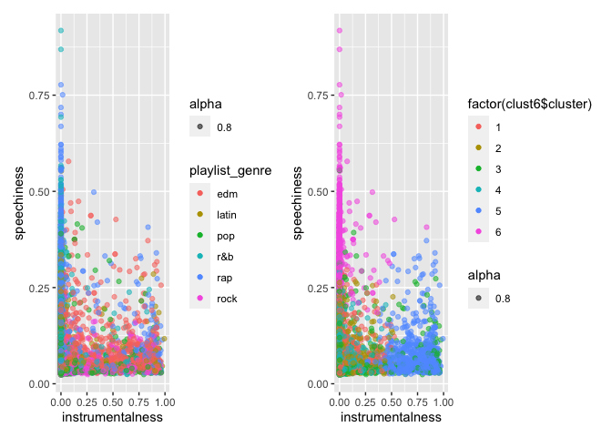

#### Agglomerative Hierarchical Clustering

The second clustering approach implemented in the analysis is
agglomerative hierarchical clustering. In order to decide which linkage
method would be ideal, we decided to observe the balance in terms of
cluster distrbution i.e. the number of observations in each cluster. We
tested the complete, ward, single, and average linkage methods for k=6
(chosen from the “Elbow Plot” below). The cluster distribution for each
method is shown below. It can be seen that the most balanced and evenly
distbution observations arise from the ward method, making it the method
of choice. For the ward method, the linkage function specifying the
distance between two clusters is computed as the increase in the “error
sum of squares” after fusing two clusters into a single cluster.

    ## Cluster balance for method=complete

    ##    1    2    3    4    5    6 
    ## 5409 3427  273  498  391    1

    ## Cluster balance for method=ward

    ##    1    2    3    4    5    6 
    ## 1973 2460 3005 1260  956  345

    ## Cluster balance for method=single

    ##    1    2    3    4    5    6 
    ## 9992    1    3    1    1    1

    ## Cluster balance for method=average

    ##    1    2    3    4    5    6 
    ## 9977   11    3    4    1    3

#### Ward Dendrogram

The dendrogram for the ward clustering is displayed below with different
colored rectangles encapsulating the clusters formed. The dendrogram is
relatively balanced, however the inital split on the right seems to
divide further a lot more than the inital split on the left.

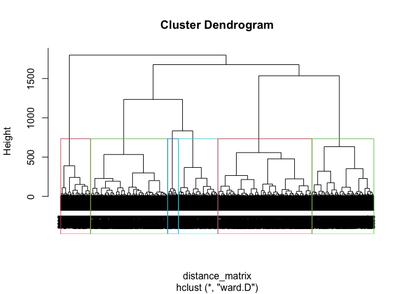

#### K-means++ vs. Ward Clustering

The cluster plots for the two clustering methods are displayed below.
K-means++ resulted in much more distinct and defined clustering than
Ward Clustering, which results in a lot more overlapping of clusters.

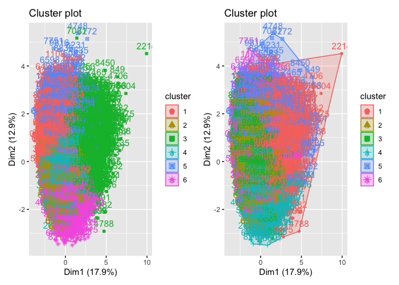

We compare the Adjusted Rand Index for both the methods against actual
genre clusters. K-means++ clusters are more similar to the actual genre
clusters than the ward clusters since K-means++ has a higher Adjusted
Rand Index.

    ## [1] "Adjusted Rand Index for genre"

    ## Rand Index for ward clustering for k=6: 0.04331738

    ## Rand Index for kmeans++ for k=6: 0.05955772

### PCA Analysis

We look at a principle component analysis for dimension reduction
techniques to incorporate in our bake-off of supervised learning models.

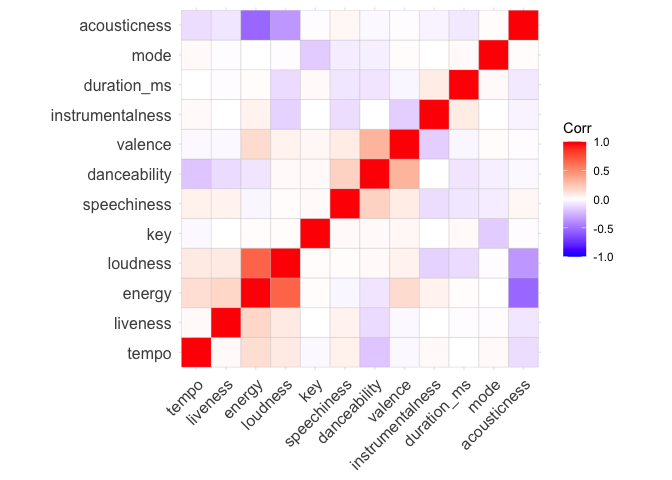

When observing correlations of features, we re-order the features
according to hierarchical clustering. In the top left and bottom right
regions of the hierarchical correlation plot, we can observe that
acousticness has a strong, negative correlation with energy and
loudness. Perhaps acoustic songs make listeners generally feel less
energy, and they are also not associated with tracks that have higher dB
(i.e. - loudness). Danceability and valence have a strong, positive
correlation. Perhaps this correlation can be attributed to the idea that
if songs make listeners feel happier, then they will want to dance more.
Some relationships that do not seem intuitive is the negative
correlation between danceability and tempo, where higher tempo may
induce listeners to dance more.

    ## Importance of first k=3 (out of 12) components:
    ##                           PC1    PC2     PC3
    ## Standard deviation     1.4644 1.2439 1.08600
    ## Proportion of Variance 0.1787 0.1289 0.09828
    ## Cumulative Proportion  0.1787 0.3076 0.40592

There are several takeaways from observing the summary of the analysis.
We see the standard deviation of the PCs is highest in PC1. The
proportion of variance each PC accounts for from the original data is
low and hovers between .09 and .1787, but this proportion is highest in
PC1. Cumulatively, all three principle components account for a little
more than two-thirds of the variation from the original data. Since the
variation is not well preserved in the the three principle components,
the CLUSTERING METHOD IS PREFERERD OVER THS ONE.

Looking at the table, we notice similar loadings in PC1 as the
correlation plot such as danceability and loudness as well as the
opposing magnitudes of danceability and acousticness as well as
danceability and loudness. The higher, positive magnitudes associated
with each feature represents stronger positive correlations and higher,
negative magnitudes associated with each feature represents stronger,
negative correlations. PC2 shows danceability and valence moving in a
similar direction as well.

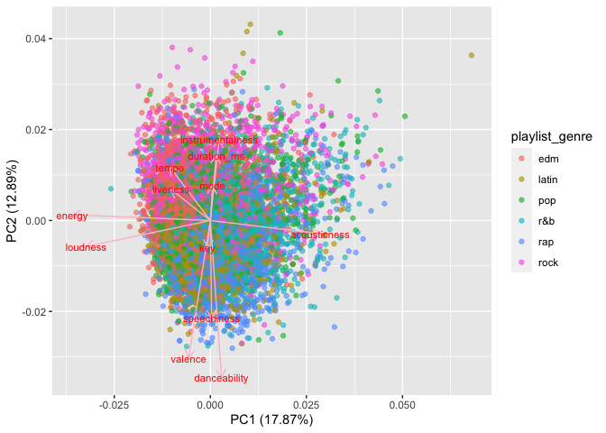

When plotting the first two components against one another, we see that
the PCA does not explain the variability well at all. The variability is
seldom captured by the PCA as per the previous PCA summary table. Rock
seems to push towards the upper left quadrant which maps slightly better
towards PC2 than PC1.

### Decision trees and random forests

One technique we have not utilized thus far for classification is
decision trees and random forests. Decision trees are a great method for
classification because they are nonparametric and tend to work well out
of the box. However, using a singular decision tree makes it prone to
overfitting and capturing random noise in the data. To fix this we can
use random forests, which aggregate predictions over a large number of
decision trees. Let’s first try a singular tree for playlist genre
classification:

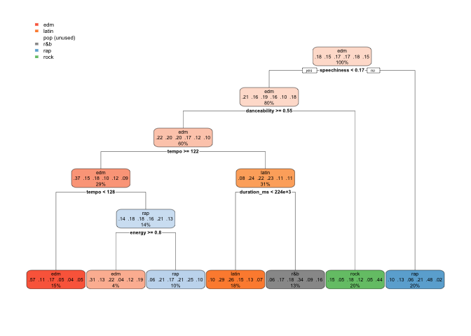

Here in our dendrogram we can see several decision splits that make
sense. The first split it makes is based on speechiness, the density of
spoken words in a song. Right off the bat, it calls everything with
speechiness &gt;= 0.18 rap, which makes sense intuitively. Rap songs
tend to have the most spoken content. It then classifies everything that
has danceability &lt; 0.55 as rock, which also makes sense–you can’t
really dance to Metallica like you would Latin or EDM.

One problem we can see right off the bat, though, is that our decision
tree does not even classify anything as Pop, even though our training
data has 1344 Pop playlist songs. This is a significant classification
error by our model, so it’s something we can improve on. Let’s look at
our out-of-sample classification accuracy:

    ##           
    ## y_hat_test edm latin pop r&b rap rock
    ##      edm   213    48  75  11  20   29
    ##      latin  45   101  84  55  52   28
    ##      pop     0     0   0   0   0    0
    ##      r&b    18    50  48  77  29   31
    ##      rap    63    99  57 109 219   31
    ##      rock   51    27  73  46  30  181

    ## [1] 0.3955

Here we have a table of our predicted class vs. our true class, and a
classification accuracy of 40.4 percent. This is not great, so we’ll now
try a random forest to see if our predictions get better. We can also
draw a lot of valuable insights from variable importance plots with
random forests.

After running a random forest of our playlist genre on our key
Spotify-developed music metrics (danceability, acousticness,
instrumentalness, etc.), we can make a variable importance plot to tell
us which features are most crucial for correct classification of genre:

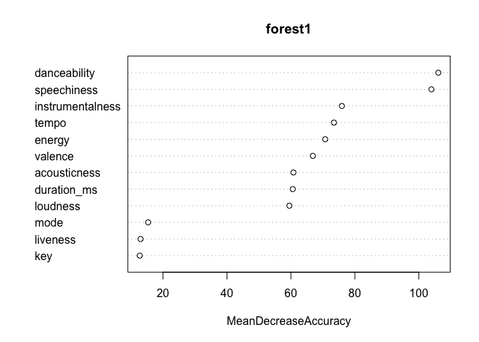

This tells us that speechiness and danceability are by far the most
important variables for accurate classfication–to omit these variables
would each lead to more than a 100 percent decrease in classification
accuracy. All our variables are useful, here though, so we can include
them all in our forest. We can also see how many trees it takes for our
forest to provide the most accurate classifications:

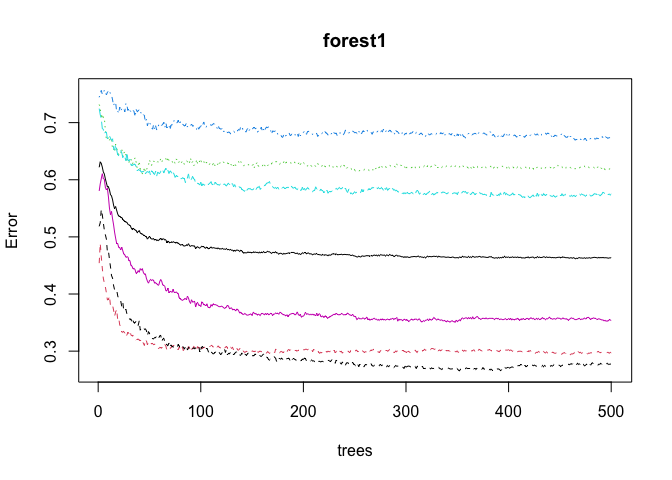

Here we can see that overall classification error bottoms our at about
325 trees, but some genres (denoted by different colored lines on the
plot) are still much more harder to classify than others. The blue line
at the top is our notoriously-difficult-to-classify Pop genre.

Let’s look at overall classification accuracy with our new random
forest:

    ##           
    ## y_hat_test edm latin pop r&b rap rock
    ##      edm   251    34  60  11  20   12
    ##      latin  23   115  36  32  35    8
    ##      pop    61    51 117  33  17   27
    ##      r&b    18    52  39 121  48   19
    ##      rap    24    55  24  77 217    5
    ##      rock   13    18  61  24  13  229

    ## [1] 0.525

Looks like we’re performing a lot better now! Our model is now correctly
identifying some pop songs, and our overall classification accuracy has
increased by 13 percent.

Next we will try our final tree-based classification method,
gradient-boosted trees. Gradient-boosted trees use a shrinkage factor to
avoid overfitting, but are more sensitive to hyperparameter tuning than
random forests. We’ll start out with an interaction depth of 4, 500
trees, and a shrinkage factor of .05.

    ## Distribution not specified, assuming multinomial ...

    ## Warning: Setting `distribution = "multinomial"` is ill-advised as it is
    ## currently broken. It exists only for backwards compatibility. Use at your own
    ## risk.

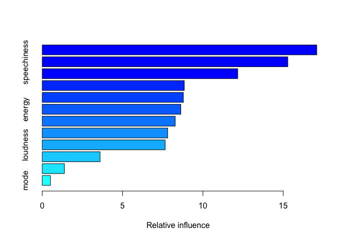

<table class="gt_table">
  <thead class="gt_header">
    <tr>
      <th colspan="2" class="gt_heading gt_title gt_font_normal gt_bottom_border" style="font-family: &#39;Libre Franklin&#39;; font-weight: 800;">Variable name and relative influence</th>
    </tr>
    
  </thead>
  <thead class="gt_col_headings">
    <tr>
      <th class="gt_col_heading gt_columns_bottom_border gt_left" rowspan="1" colspan="1" style="color: #A9A9A9; font-family: &#39;Source Sans Pro&#39;; text-transform: uppercase;">var</th>
      <th class="gt_col_heading gt_columns_bottom_border gt_right" rowspan="1" colspan="1" style="color: #A9A9A9; font-family: &#39;Source Sans Pro&#39;; text-transform: uppercase;">rel.inf</th>
    </tr>
  </thead>
  <tbody class="gt_table_body">
    <tr><td class="gt_row gt_left" style="font-family: &#39;Source Sans Pro&#39;; font-weight: 400;">tempo</td>
<td class="gt_row gt_right" style="font-family: &#39;Source Sans Pro&#39;; font-weight: 400;">17.0842327</td></tr>
    <tr><td class="gt_row gt_left" style="font-family: &#39;Source Sans Pro&#39;; font-weight: 400;">speechiness</td>
<td class="gt_row gt_right" style="font-family: &#39;Source Sans Pro&#39;; font-weight: 400;">15.2816184</td></tr>
    <tr><td class="gt_row gt_left" style="font-family: &#39;Source Sans Pro&#39;; font-weight: 400;">danceability</td>
<td class="gt_row gt_right" style="font-family: &#39;Source Sans Pro&#39;; font-weight: 400;">12.1647104</td></tr>
    <tr><td class="gt_row gt_left" style="font-family: &#39;Source Sans Pro&#39;; font-weight: 400;">valence</td>
<td class="gt_row gt_right" style="font-family: &#39;Source Sans Pro&#39;; font-weight: 400;">8.8381346</td></tr>
    <tr><td class="gt_row gt_left" style="font-family: &#39;Source Sans Pro&#39;; font-weight: 400;">duration_ms</td>
<td class="gt_row gt_right" style="font-family: &#39;Source Sans Pro&#39;; font-weight: 400;">8.7847877</td></tr>
    <tr><td class="gt_row gt_left" style="font-family: &#39;Source Sans Pro&#39;; font-weight: 400;">energy</td>
<td class="gt_row gt_right" style="font-family: &#39;Source Sans Pro&#39;; font-weight: 400;">8.6240343</td></tr>
    <tr><td class="gt_row gt_left" style="font-family: &#39;Source Sans Pro&#39;; font-weight: 400;">instrumentalness</td>
<td class="gt_row gt_right" style="font-family: &#39;Source Sans Pro&#39;; font-weight: 400;">8.2735075</td></tr>
    <tr><td class="gt_row gt_left" style="font-family: &#39;Source Sans Pro&#39;; font-weight: 400;">acousticness</td>
<td class="gt_row gt_right" style="font-family: &#39;Source Sans Pro&#39;; font-weight: 400;">7.8049217</td></tr>
    <tr><td class="gt_row gt_left" style="font-family: &#39;Source Sans Pro&#39;; font-weight: 400;">loudness</td>
<td class="gt_row gt_right" style="font-family: &#39;Source Sans Pro&#39;; font-weight: 400;">7.6482716</td></tr>
    <tr><td class="gt_row gt_left" style="font-family: &#39;Source Sans Pro&#39;; font-weight: 400;">liveness</td>
<td class="gt_row gt_right" style="font-family: &#39;Source Sans Pro&#39;; font-weight: 400;">3.6032225</td></tr>
    <tr><td class="gt_row gt_left" style="font-family: &#39;Source Sans Pro&#39;; font-weight: 400;">key</td>
<td class="gt_row gt_right" style="font-family: &#39;Source Sans Pro&#39;; font-weight: 400;">1.3780853</td></tr>
    <tr><td class="gt_row gt_left" style="font-family: &#39;Source Sans Pro&#39;; font-weight: 400;">mode</td>
<td class="gt_row gt_right" style="font-family: &#39;Source Sans Pro&#39;; font-weight: 400;">0.5144732</td></tr>
  </tbody>
  
  
</table>

Our gradient-boosted tree came up with slightly different results for
what influences classification accuracy than our random forest did.
Speechiness and danceability are still on top, but we see now that tempo
is the most influential variable in improving classification accuracy.
Let’s see if our gradient-boosted tree was more accurate:

    ## Using 500 trees...

    ##           
    ## y_hat_test edm latin pop r&b rap rock
    ##          1 246    26  60  12  16   11
    ##          2  27   124  43  35  38    9
    ##          3  71    58 116  42  19   45
    ##          4  17    56  41 127  47   21
    ##          5  18    46  23  63 217    2
    ##          6  11    15  54  19  13  212

    ## [1] 0.521

Here we get a very tiny improvement in performance for our
gradient-boosted tree (.1 percent) over our random forest. This might
tell us something important: that tempo is more informative for
classification than we previously thought.

### Predicting with song titles

One of our group members was consumed with the question: do certain
genres use certain words more frequently in song names, and can we
classify genre with nothing but song and album titles?

The tool we used to answer this question was Multinomial Naive Bayes,
which is essentially regression in reverse: it involves predicting
features based on a class label. We started with preprocessing: we took
all of the songs in our dataset and engineered a column that combined
song and album name, all lowercase and without special characters. We
then fed our list of song names and word strings into the “text2map”
document-term-builder tool to build a sparse matrix that one-hot-encoded
the presence of certain words in a song and album title. We then trained
our data on a subset of the genre labels and the document-term-matrix
with Multinomial Naive Bayes, and then saw how accurately we could
predict genres. Let’s see how we did:

    ##        y_test_pred
    ## y_test  edm latin pop r&b rap rock
    ##   edm   200     7  73  44  46   29
    ##   latin  29   164  40  29  40   28
    ##   pop    70    25  93  62  47   46
    ##   r&b    35    13  65 106  36   33
    ##   rap    35    50  35  61 147   32
    ##   rock   19     5  40  32  18  166

    ## [1] 0.438

Looks like we can predict with 43.7 percent accuracy, which is not too
bad, considering we were training only on the presence of certain words
in our song and album titles. One of the shortcomings of this approach,
though, is that artists’ names are often in song titles, and this
provides artificial advantage given that most artists stick only to
certain genres.
